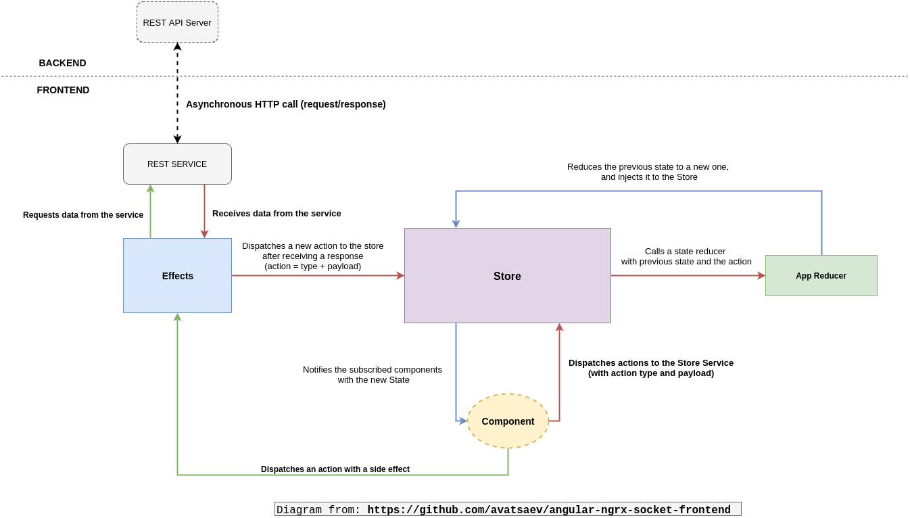
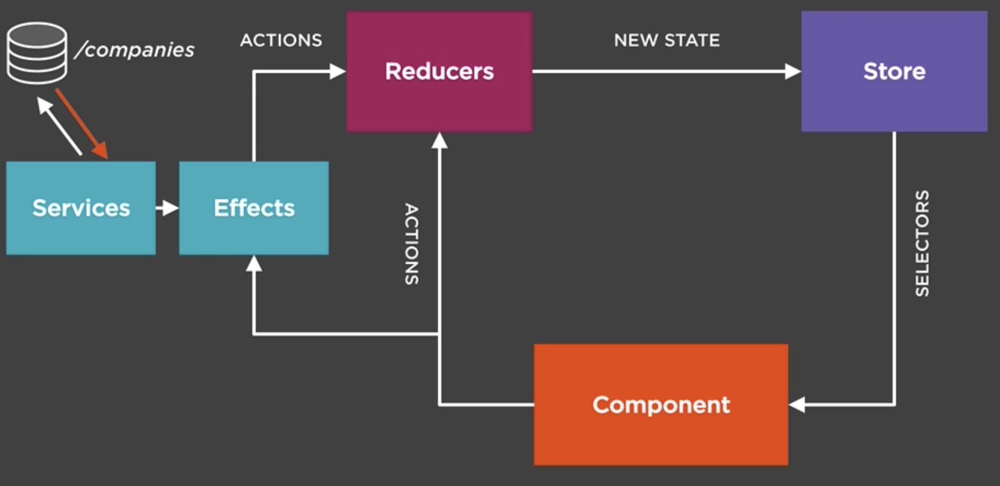

## Full application flow

### Some useful resource

- https://medium.com/front-end-hacking/an-intro-to-ngrx-effects-ngrx-store-with-angular-4-c55c4d1d5baf

- https://medium.com/@tanya/understanding-ngrx-effects-and-the-action-stream-1a74996a0c1c

- https://blog.angularindepth.com/start-using-ngrx-effects-for-this-e0b2bd9da165

### Boilerplate

- https://github.com/ngrx/platform/blob/master/docs/schematics/README.md

- https://www.youtube.com/watch?v=t3jx0EC-Y3c
