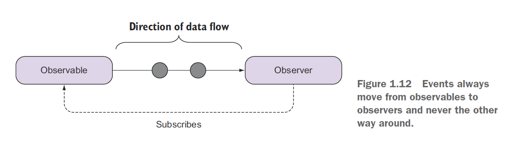

## Components of an Rx stream

- Producers
- Consumers
- Data pipeline
- Time

### PRODUCERS

Producers are the sources of your data. A stream must always have a producer of data,
which will be the starting point for any logic that you’ll perform in RxJS. In practice, a
producer is created from something that generates events independently (anything
from a single value, an array, mouse clicks, to a stream of bytes read from a file). The
observer pattern defines producers as the subject; in RxJS, we call them observables, as in
something that’s able to be observed.
Observables are in charge of pushing notifications, so we refer to this behavior as
fire-and-forget, which means that we’ll never expect the producer to be involved in
the processing of events, only the emission of them.

### CONSUMERS

To balance the producer half of the equation, you must also have a consumer to
accept events from the producer and process them in some specific way. When the
consumer begins listening to the producer for events to consume, you now have a
stream, and it’s at this point that the stream begins to push events; we’ll refer to a consumer
as an observer.
Streams travel only from the producer to the consumer, not the other way around.

With respect to RxJS, a stream will always flow from an upstream observable to a downstream
observer, and both components are loosely coupled, which increases the modularity
of your application,

### DATA PIPELINE

One advantage of RxJS is that you can manipulate or edit the data as it passes from the
producer to the consumer. This is where the list of methods (known as observable
operators) comes into play. Manipulating data en route means that you can adapt the
output of the producer to match the expectations of the consumer. Doing so promotes
a separation of concerns6 between the two entities, and it’s a big win for the modularity
of your code.

### TIME

The implicit factor behind all of this is time. For everything RxJS there’s always an
underlying concept of time, which you can use to manipulate streams.

## Functional programs have the following characteristics

### Declarative

Functional code has a peculiar style, which takes advantage of
JavaScript’s higher-order functions to apply specialized business logic.

### Immutable

An immutable program (and by this we mean any immutable function,
module, or whole program) is one that never changes or modifies data
after it’s been created or after its variables have been declared. This can be a radical
concept to grasp, especially when you’re coming from an OO background.
Functional programs treat data as immutable, constant values.

### Side effect–free

Functions with side effects depend on data residing outside its
own local scope. A function’s scope is made up of its arguments and any local
variables declared within. Interacting with anything outside this (like reading a
file, writing to the console, rendering elements on an HTML page, and more) is
considered a side effect and should be avoided or, at the very least, isolated

## The iterator pattern

A key design principle behind RxJS streams is to give you a familiar traversal mechanism, just as you have with arrays. Iterators are used to traverse containers of data in a structure-agnostic way or independent of the underlying data structure used to harness these elements, whether it’s an array, a tree, a map, or even a stream. In addition, this pattern is effective at decoupling the business logic applied at each element from the iteration itself.

